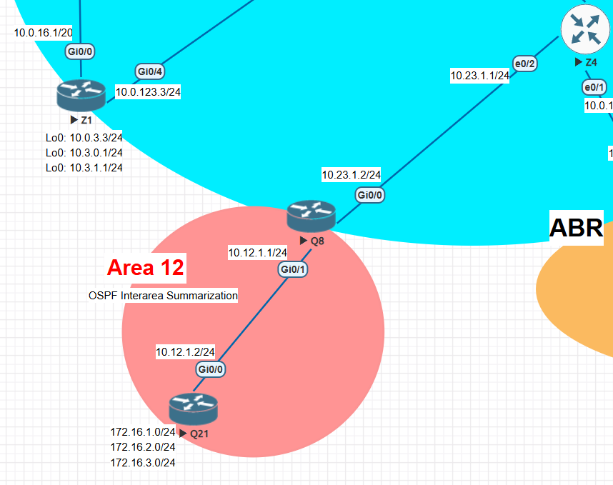

# Lab 1: OSPF Interarea Route Summarization

## Objective
- Understand how OSPF interarea summarization works.
- Configure an ABR (Area Border Router) to summarize multiple subnets into one summary route.
- Verify routing tables before and after summarization.

## Theory (Basic Summary)
- Interarea summarization is configured **only on ABRs**.
- Command (under OSPF process on the ABR): `area <area-id> range <network> <subnet-mask> [advertise | not-advertise] [cost <metric>]`
- By default, the summary prefix **is advertised** (you don’t need `advertise`).
- You can set a static **cost** for the summary route (for example to reduce CPU load if routes flap).
- OSPF creates a **discard (Null0) route** for the summary to prevent loops when a more specific route is missing.

## Configuration

### R1 (Area 12 networks)
    router ospf 1
     router-id 192.168.1.1
     network 172.16.1.0 0.0.0.255 area 12
     network 172.16.2.0 0.0.0.255 area 12
     network 172.16.3.0 0.0.0.255 area 12
     network 10.12.0.0 0.0.255.255 area 12

### R2 (ABR performing summarization)
    router ospf 1
     router-id 192.168.2.2
     area 12 range 172.16.0.0 255.255.0.0 cost 45
     network 10.12.0.0 0.0.255.255 area 12
     network 10.23.0.0 0.0.255.255 area 0

### R3 (Backbone Area 0)
    router ospf 1
     router-id 192.168.3.3
     network 10.23.0.0 0.0.255.255 area 0

## Verification

### Before summarization (on R3)
    R3# show ip route ospf
      O IA 172.16.1.0/24 [110/3] via 10.23.1.2
      O IA 172.16.2.0/24 [110/3] via 10.23.1.2
      O IA 172.16.3.0/24 [110/3] via 10.23.1.2

### After summarization (on R3)
    R3# show ip route ospf
      O IA 172.16.0.0/16 [110/46] via 10.23.1.2

### Discard (summary) route on ABR (R2)
    R2# show ip route ospf
      O 172.16.0.0/16 is a summary, Null0

## Key Points
- Summarization reduces routing table size and LSA flooding.
- Faster convergence and less CPU usage on routers.
- The ABR automatically installs a **Null0** summary route for loop prevention.

Topology used:

