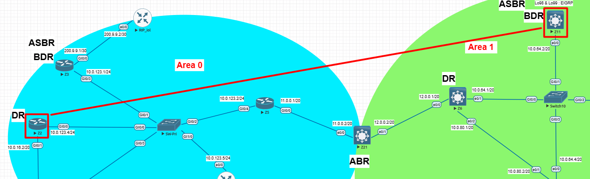

# 🔹 Lab 2 – OSPF Configuration & Validation
## ⚙️ Configuration
### 🔀 **Z2** (Area 0)
```bash
configure terminal
!
ip access-list standard ACL-OSPF-FILTER
 deny 192.168.200.200 0.0.0.0
 permit any
!
router ospf 100
 distribute-list FILTRO in
!
end
```

### 🔀 **Z11** (Area 1)

This router's configuration shows how to advertise the `192.168.200.200` network in OSPF Area 1.

```bash
Z11# show ip int brief | i 200
Loopback200        192.168.200.200 YES manual up up
!
router ospf 100
 router-id 11.11.11.11
 redistribute eigrp 100 metric 1 subnets
 network 10.0.64.0 0.0.15.255 area 1
 network 192.168.200.200 0.0.0.0 area 1  <-- This is the network that will be filtered on R2
 network 192.168.201.201 0.0.0.0 area 1
 network 192.168.202.202 0.0.0.0 area 1
 network 192.168.203.203 0.0.0.0 area 1
!
```
-----

## 🔍 Validation
✅

-----

## 🗺️ Topology



-----
