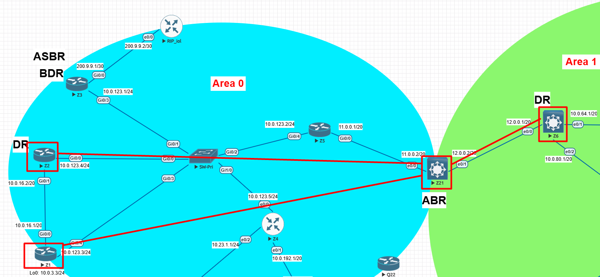

# 🔹 Lab 3.1 – OSPF Configuration & Validation
## ⚙️ Configuration
### 🔀 **Z1** 
```bash
interface Loopback78
 ip address 10.10.78.78 255.255.255.255
!
router ospf 100
 router-id 1.1.1.1
 network 10.0.16.0 0.0.15.255 area 0
 network 10.0.123.0 0.0.0.255 area 0
 network 10.10.78.78 0.0.0.0 area 0       <-- This is the network
```
### 🔀 **Z2** 
```bash
interface Loopback77
 ip address 10.10.77.77 255.255.255.255
!
router ospf 100
 router-id 2.2.2.2
 network 10.0.16.0 0.0.15.255 area 0
 network 10.0.123.0 0.0.0.255 area 0
 network 10.10.77.77 0.0.0.0 area 0       <-- This is the network
 distribute-list ACL-OSPF-FILTER in
```
### 🔀 **Z21** 
```bash
ip prefix-list PREFIX-FILTER-AREA0-1 seq 6 deny 10.10.0.0/16 ge 32
ip prefix-list PREFIX-FILTER-AREA0-1 seq 100 permit 0.0.0.0/0 le 32
!
router ospf 100
 router-id 21.21.21.21
 area 0 filter-list prefix PREFIX-FILTER-OSPF in
 area 0 filter-list prefix PREFIX-FILTER-AREA0-1 out       <-- This is the command
 network 11.0.0.0 0.0.15.255 area 0
 network 12.0.0.0 0.0.15.255 area 1
```
### 🔀 **Z21 Another way to do it.**
```bash
area 1 filter-list prefix PREFIX-FILTER-AREA0-1 in
```
-----

## 🔍 Validation

✅ Before (on Z6)
```bash
Z6(config)#do sh ip route 10.10.76.0 255.255.252.0 longer-prefixes

Gateway of last resort is 10.0.80.2 to network 0.0.0.0

      10.0.0.0/8 is variably subnetted, 19 subnets, 3 masks
O IA     10.10.77.77/32 [110/22] via 12.0.0.2, 00:11:46, Ethernet0/0
O IA     10.10.78.78/32 [110/22] via 12.0.0.2, 00:57:08, Ethernet0/0

```
✅ After summarization (on Z6)
```bash
Z6(config)#do sh ip route 10.10.76.0 255.255.252.0 longer-prefixes

Gateway of last resort is 10.0.80.2 to network 0.0.0.0

```

-----

## 🖧 Topology


