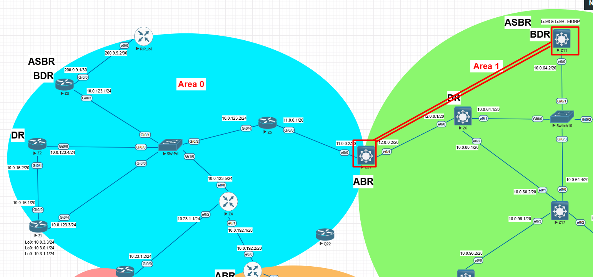

# 🔹 Lab X – OSPF Configuration & Validation
## ⚙️ Configuration
### 🔀 **Z21** (Area 12)
```bash
ip prefix-list PREFIX-FILTER-OSPF seq 5 deny 192.168.200.200/32
ip prefix-list PREFIX-FILTER-OSPF seq 10 permit 0.0.0.0/0 le 32
!
router ospf 100
 router-id 21.21.21.21
 area 0 filter-list prefix PREFIX-FILTER-OSPF in
```
### 🔀 **Z11** (ABR)

```bash
router ospf 100
 router-id 11.11.11.11
 redistribute eigrp 100 metric 1 subnets
 network 10.0.64.0 0.0.15.255 area 1
 network 192.168.200.200 0.0.0.0 area 1   <-- This is the route
 network 192.168.201.201 0.0.0.0 area 1   <-- This is the route
 network 192.168.202.202 0.0.0.0 area 1   <-- This is the route
 network 192.168.203.203 0.0.0.0 area 1   <-- This is the route
```

-----

## 🔍 Validation

✅ Before (on Z5)
```bash
Z5#sh ip route 192.168.200.200 255.255.255.0 longer-prefixes
Gateway of last resort is 11.0.0.2 to network 0.0.0.0

      192.168.200.0/32 is subnetted, 1 subnets
O IA     192.168.200.200 [110/22] via 11.0.0.2, 00:01:11, GigabitEthernet0/0

```
✅ After summarization (on Z11)
```bash
Z5#sh ip route 192.168.200.200 255.255.255.0 longer-prefixes

Gateway of last resort is 11.0.0.2 to network 0.0.0.0

```

-----

## 🖧 Topology



-----
