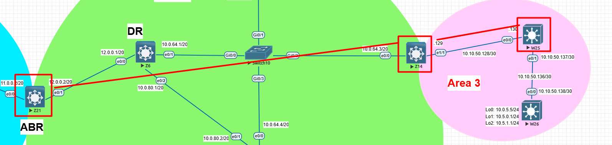

# 🔹 Lab 4 – OSPF Configuration & Validation
## ⚙️ Configuration
### 🔀 **Z14** (Area 12)
```bash

```
### 🔀 **W25** (ABR)

```bash

```

-----

## 🔍 Validation

✅ Before (on Z21)
```bash

```
✅ After summarization (on Z11)
```bash

```

-----

## 🖧 Topology



-----
