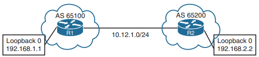

# 🔹 Lab 2 – BGP Configuration & Validation
## ⚙️ Configuration
### 🔀 **R1** (Default IPv4 Address-Family Enabled)
```bash
router bgp 65100
 neighbor 10.12.1.2 remote-as 65200
```
### 🔀 **R2** (Default IPv4 Address-Family Disabled)

```bash
router bgp 65200
 no bgp default ipv4-unicast
 neighbor 10.12.1.1 remote-as 65100
 !
 address-family ipv4
 neighbor 10.12.1.1 activate
 exit-address-family
```

-----

## 🔍 Validation

✅ Before (on Z21)
```bash

```
✅ After (on Z11)
```bash
R1# show bgp ipv4 unicast summary
BGP router identifier 192.168.2.2, local AS number 65200
BGP table version is 1, main routing table version 1
Neighbor       V      AS      MsgRcvd MsgSent TblVer InQ OutQ   Up/Down    State/PfxRcd
10.12.1.2      4     65200       8       9      1      0   0    00:05:23        0
```

-----

## 🖧 Topology



-----
