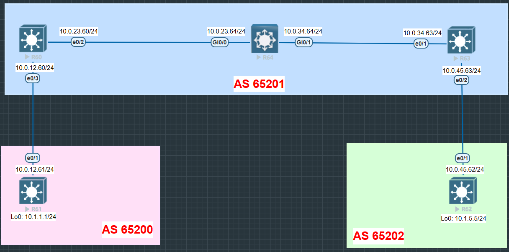

# 🔹 Lab 1_1 – BGP Configuration & Validation
We have a problem because I cannot see the all the routes, the reason is that BGP does nos show prefixs from IGP to EGP
## ⚙️ Configuration
### 🔀 **R60** 
```bash
interface Loopback60
 ip address 60.60.60.60 255.255.255.255
!
interface Loopback660
 no ip address
 ipv6 address 60::60/128
!
interface Ethernet0/0
 ip address 192.168.113.60 255.255.255.0
!
interface Ethernet0/1
 ip address 192.168.112.60 255.255.255.0
!
interface Ethernet0/2
 ip address 192.168.110.60 255.255.255.0
 ipv6 address FE80::60:64:60 link-local
 ipv6 address 2001:60:64::60/64
!
interface Ethernet0/3
 ip address 192.168.117.60 255.255.255.0
 ipv6 address FE80::61:60:60 link-local
 ipv6 address 2001:61:60::60/64
!
router bgp 65201
 bgp router-id 60.60.60.60
 bgp log-neighbor-changes
 network 60.60.60.60 mask 255.255.255.255
 neighbor 192.168.110.64 remote-as 65201
 neighbor 192.168.111.63 remote-as 65201
 neighbor 192.168.117.61 remote-as 65200
```
### 🔀 **R64** 
```bash
interface GigabitEthernet0/0
 ip address 10.0.23.64 255.255.255.0
 ip ospf 100 area 0            <----
 duplex auto
 speed auto
 media-type rj45
!
interface GigabitEthernet0/1
 ip address 10.0.34.64 255.255.255.0
 ip ospf 100 area 0               <----
 duplex auto
 speed auto
 media-type rj45
!
router ospf 100                  <----       
 router-id 63.63.63.63            <----
!
router bgp 65201
 bgp router-id 64.64.64.64
 bgp log-neighbor-changes
 network 64.64.64.64 mask 255.255.255.255
 neighbor 10.0.23.60 remote-as 65201
 neighbor 10.0.34.63 remote-as 65201
```
### 🔀 **R63** 
```bash
interface Ethernet0/1
 ip address 10.0.34.63 255.255.255.0
 ip ospf 100 area 0                   <----
!
router ospf 100                   <----
 router-id 63.63.63.63            <----
!
router bgp 65201
 bgp router-id 63.63.63.63
 bgp log-neighbor-changes
 network 63.63.63.63 mask 255.255.255.255
 neighbor 10.0.23.60 remote-as 65201
 neighbor 10.0.34.64 remote-as 65201
 neighbor 10.0.45.62 remote-as 65202           <----
```

-----

## 🔍 Validation

✅ Before (on R60)
```bash
R60#sh ip bgp

     Network          Next Hop            Metric LocPrf Weight Path
 *>  60.60.60.60/32   0.0.0.0                  0         32768 i
 *>  61.61.61.61/32   10.0.12.61               0             0 65200 i
 *>i 64.64.64.64/32   10.0.23.64               0    100      0 i
```
✅ After (on R60)
```bash
R60#sh ip bgp

     Network          Next Hop            Metric LocPrf Weight Path
 *>  60.60.60.60/32   0.0.0.0                  0         32768 i
 *>  61.61.61.61/32   10.0.12.61               0             0 65200 i
 * i 62.62.62.62/32   10.0.45.62               0    100      0 65202 i
 *>i 63.63.63.63/32   10.0.34.63               0    100      0 i
 *>i 64.64.64.64/32   10.0.23.64               0    100      0 i
```

-----

## 🖧 Topology



-----

