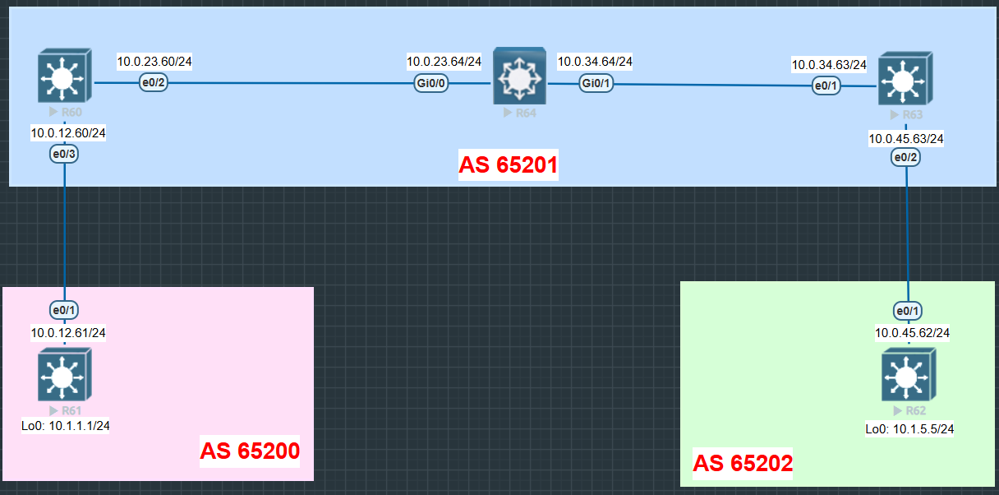

# 🔹 Lab 2 – BGP Configuration & Validation
## ⚙️ Configuration
### 🔀 **R64** 
```bash
router bgp 65201
 bgp router-id 64.64.64.64
 bgp log-neighbor-changes
 network 64.64.64.64 mask 255.255.255.255
 neighbor 10.0.23.60 remote-as 65201
 neighbor 10.0.23.60 route-reflector-client
 neighbor 10.0.34.63 remote-as 65201
 neighbor 10.0.34.63 route-reflector-client
```
-----

## 🔍 Validation

✅ Before (on R63)
```bash
R63#sh ip bgp
BGP table version is 17, local router ID is 63.63.63.63

     Network          Next Hop            Metric LocPrf Weight Path
 *>  62.62.62.62/32   10.0.45.62               0             0 65202 i
 *>  63.63.63.63/32   0.0.0.0                  0         32768 i
 *>i 64.64.64.64/32   10.0.34.64               0    100      0 i
```
✅ Before (on R60)
```bash
R60#sh ip bgp
BGP table version is 17, local router ID is 60.60.60.60

     Network          Next Hop            Metric LocPrf Weight Path
 *>  60.60.60.60/32   0.0.0.0                  0         32768 i
 *>  61.61.61.61/32   10.0.12.61               0             0 65200 i
 *>i 64.64.64.64/32   10.0.23.64               0    100      0 i
```
✅ After (on R63)
```bash
R63#sh ip bgp

     Network          Next Hop            Metric LocPrf Weight Path
 *>i 60.60.60.60/32   10.0.23.60               0    100      0 i
 *>  62.62.62.62/32   10.0.45.62               0             0 65202 i
 *>  63.63.63.63/32   0.0.0.0                  0         32768 i
 *>i 64.64.64.64/32   10.0.34.64               0    100      0 i
```
✅ After (on R60)
```bash
R60#sh ip bgp
BGP table version is 22, local router ID is 60.60.60.60

     Network          Next Hop            Metric LocPrf Weight Path
 *>  60.60.60.60/32   0.0.0.0                  0         32768 i
 *>  61.61.61.61/32   10.0.12.61               0             0 65200 i
 *>i 63.63.63.63/32   10.0.34.63               0    100      0 i
 *>i 64.64.64.64/32   10.0.23.64               0    100      0 i
```
-----

## 🖧 Topology



-----
