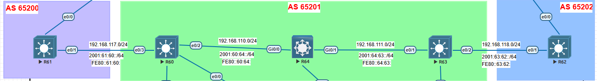

# 🔹 Lab 3 – BGP Configuration & Validation
We are going to review the summarization, as-path, and config using loopback
## ⚙️ Configuration
### 🔀 **R61** 
```bash
router bgp 65200
 bgp router-id 61.61.61.61
 bgp log-neighbor-changes
 no bgp default ipv4-unicast
 neighbor 2001:61:60::60 remote-as 65201
 neighbor 60.60.60.60 remote-as 65201
 neighbor 60.60.60.60 ebgp-multihop 2
 neighbor 60.60.60.60 update-source Loopback61
 !
 address-family ipv4
  network 1.1.1.99 mask 255.255.255.255
  network 61.61.61.61 mask 255.255.255.255
  network 192.168.1.0 mask 255.255.255.224
  network 192.168.1.32 mask 255.255.255.224
  network 192.168.1.64 mask 255.255.255.224
  neighbor 60.60.60.60 activate
 exit-address-family
 !
 address-family ipv6
  network 61::61/128
  network 77::77/128
  neighbor 2001:61:60::60 activate
 exit-address-family
```
### 🔀 **R60** 
```bash
router bgp 65201
 bgp router-id 60.60.60.60
 bgp log-neighbor-changes
 no bgp default ipv4-unicast
 neighbor 2001:61:60::61 remote-as 65200
 neighbor 61.61.61.61 remote-as 65200
 neighbor 61.61.61.61 ebgp-multihop 2
 neighbor 61.61.61.61 update-source Loopback60
 neighbor 192.168.110.64 remote-as 65201
 !
 address-family ipv4
  network 60.60.60.60 mask 255.255.255.255
  aggregate-address 192.168.1.0 255.255.255.0 as-set summary-only
  neighbor 61.61.61.61 activate
  neighbor 192.168.110.64 activate
  neighbor 192.168.110.64 next-hop-self
 exit-address-family
 !
 address-family ipv6
  network 60::60/128
  neighbor 2001:61:60::61 activate
 exit-address-family
```
### 🔀 **R64** 
```bash
router bgp 65201
 bgp router-id 64.64.64.64
 bgp log-neighbor-changes
 network 64.64.64.64 mask 255.255.255.255
 neighbor 192.168.110.60 remote-as 65201
 neighbor 192.168.110.60 route-reflector-client
 neighbor 192.168.111.63 remote-as 65201
 neighbor 192.168.111.63 route-reflector-client
```
### 🔀 **R63** 
```bash
router bgp 65201
 bgp router-id 63.63.63.63
 bgp log-neighbor-changes
 no bgp default ipv4-unicast
 neighbor 62::62 remote-as 65202
 neighbor 62::62 ebgp-multihop 2
 neighbor 62::62 update-source Loopback663
 neighbor 192.168.111.64 remote-as 65201
 neighbor 192.168.118.62 remote-as 65202
 !
 address-family ipv4
  network 63.63.63.63 mask 255.255.255.255
  neighbor 192.168.111.64 activate
  neighbor 192.168.111.64 next-hop-self
  neighbor 192.168.118.62 activate
 exit-address-family
 !
 address-family ipv6
  network 63::63/128
  neighbor 62::62 activate
 exit-address-family
```
### 🔀 **R62** 
```bash
router bgp 65202
 bgp router-id 62.62.62.62
 bgp log-neighbor-changes
 no bgp default ipv4-unicast
 neighbor 63::63 remote-as 65201
 neighbor 63::63 ebgp-multihop 2
 neighbor 63::63 update-source Loopback662
 neighbor 192.168.118.63 remote-as 65201
 !
 address-family ipv4
  network 62.62.62.62 mask 255.255.255.255
  neighbor 192.168.118.63 activate
 exit-address-family
 !
 address-family ipv6
  network 62::62/128
  neighbor 63::63 activate
 exit-address-family
```

-----

## 🔍 Validation

✅ After
```bash
R62#sh ip bgp

     Network          Next Hop            Metric LocPrf Weight Path
 *>  1.1.1.99/32      192.168.118.63                         0 65201 65200 i
 *>  60.60.60.60/32   192.168.118.63                         0 65201 i
 *>  61.61.61.61/32   192.168.118.63                         0 65201 65200 i
 *>  62.62.62.62/32   0.0.0.0                  0         32768 i
 *>  63.63.63.63/32   192.168.118.63           0             0 65201 i
 *>  64.64.64.64/32   192.168.118.63                         0 65201 i
 *>  192.168.1.0      192.168.118.63                         0 65201 65200 i
```

-----

## 🖧 Topology



-----
