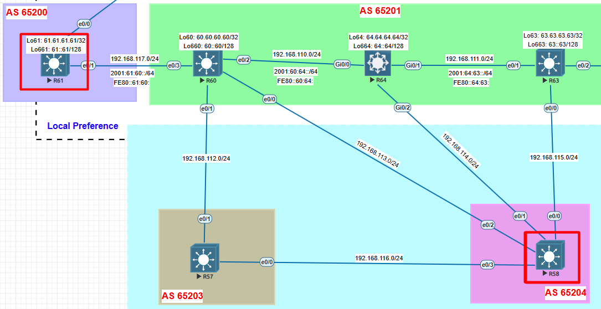

# 🔹 Lab 2 – BGP Configuration & Validation
I am going to move all the traffic using the weigh thought R63
### in (Inbound)
Se refiere a rutas que entran a tu router desde el vecino BGP.
Todo lo que el vecino te anuncia pasa por el route-map antes de entrar en tu tabla BGP local.
### out (Outbound)
Se refiere a rutas que salen de tu router hacia el vecino BGP.
Todo lo que tú anuncias al vecino se filtra o modifica antes de enviarse.
## ⚙️ Configuration
### 🔀 **R58** 
```bash
R58#sh runn | se bgp
router bgp 65204
 bgp router-id 58.58.58.58
 bgp log-neighbor-changes
 no bgp default ipv4-unicast
 neighbor 57.57.57.57 remote-as 65203
 neighbor 57.57.57.57 ebgp-multihop 2
 neighbor 57.57.57.57 update-source Loopback58
 neighbor 60.60.60.60 remote-as 65201
 neighbor 60.60.60.60 ebgp-multihop 2
 neighbor 60.60.60.60 update-source Loopback58
 neighbor 64.64.64.64 remote-as 65201
 neighbor 64.64.64.64 ebgp-multihop 2
 neighbor 64.64.64.64 update-source Loopback58
 neighbor 192.168.115.63 remote-as 65201
 !
 address-family ipv4
  network 58.58.58.58 mask 255.255.255.255
  neighbor 57.57.57.57 activate
  neighbor 60.60.60.60 activate
  neighbor 64.64.64.64 activate
  neighbor 64.64.64.64 route-map FILTRO-IN-2 in
  neighbor 192.168.115.63 activate
  neighbor 192.168.115.63 weight 40000
  neighbor 192.168.115.63 route-map FILTRO-IN in
 exit-address-family
```

-----

## 🔍 Validation

✅ After 
```bash
R58#sh ip bgp
BGP table version is 1, local router ID is 58.58.58.58
Status codes: s suppressed, d damped, h history, * valid, > best, i - internal,
              r RIB-failure, S Stale, m multipath, b backup-path, f RT-Filter,
              x best-external, a additional-path, c RIB-compressed,
Origin codes: i - IGP, e - EGP, ? - incomplete
RPKI validation codes: V valid, I invalid, N Not found

     Network          Next Hop            Metric LocPrf Weight Path
 *   1.1.1.99/32      64.64.64.64                            0 65201 65200 i
 *                    57.57.57.57                            0 65203 65201 65200 i
 *                    192.168.115.63                     40000 65201 65200 i
 *                    60.60.60.60                            0 65201 65200 i
 *   11.11.11.11/32   64.64.64.64                            0 65201 65200 300 i
 *                    57.57.57.57                            0 65203 65201 65200 300 i
 *                    192.168.115.63                     40000 65201 65200 300 i
 *                    60.60.60.60                            0 65201 65200 300 i
 *   15.15.15.15/32   64.64.64.64                            0 65201 65202 500 i
 *                    57.57.57.57                            0 65203 65201 65202 500 i
 *                    192.168.115.63                     40000 65201 65202 500 i
     Network          Next Hop            Metric LocPrf Weight Path
 *                    60.60.60.60                            0 65201 65202 500 i
 *   60.60.60.60/32   64.64.64.64                            0 65201 i
 *                    57.57.57.57                            0 65203 65201 i
 *                    192.168.115.63                     40000 65201 i
 *                    60.60.60.60              0             0 65201 i
 *   61.61.61.61/32   64.64.64.64                            0 65201 65200 i
 *                    57.57.57.57                            0 65203 65201 65200 i
 *                    192.168.115.63                     40000 65201 65200 i
 *                    60.60.60.60                            0 65201 65200 i
 *   62.62.62.62/32   64.64.64.64                            0 65201 65202 i
 *                    57.57.57.57                            0 65203 65201 65202 i
 *                    192.168.115.63                     40000 65201 65202 i
 *                    60.60.60.60                            0 65201 65202 i
 *   63.63.63.63/32   64.64.64.64                            0 65201 i
 *                    57.57.57.57                            0 65203 65201 i
 *                    192.168.115.63           0         40000 65201 i
 *                    60.60.60.60                            0 65201 i
 *   64.64.64.64/32   64.64.64.64              0             0 65201 i
 *                    57.57.57.57                            0 65203 65201 i
 *                    192.168.115.63                     40000 65201 i
     Network          Next Hop            Metric LocPrf Weight Path
 *                    60.60.60.60                            0 65201 i
 *   192.168.1.0/27   64.64.64.64                            0 65201 65200 i
 *                    57.57.57.57                            0 65203 65201 65200 i
 *                    192.168.115.63                     45000 65201 65200 i
 *                    60.60.60.60                            0 65201 65200 i
 *   192.168.1.32/27  64.64.64.64                        46000 65201 65200 i
 *                    57.57.57.57                            0 65203 65201 65200 i
 *                    192.168.115.63                     40000 65201 65200 i
 *                    60.60.60.60                            0 65201 65200 i
 *   192.168.1.64/27  64.64.64.64                        46000 65201 65200 i
 *                    57.57.57.57                            0 65203 65201 65200 i
 *                    192.168.115.63                     40000 65201 65200 i
 *                    60.60.60.60                            0 65201 65200 i
```

-----

## 🖧 Topology



-----
