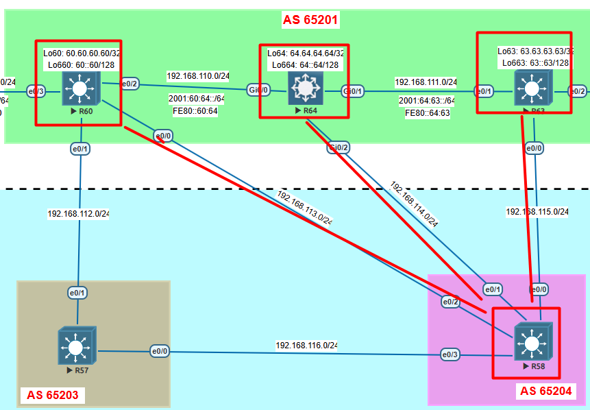

# 🔹 Lab 6 – BGP Configuration & Validation
config local preference
## ⚙️ Configuration
### 🔀 **R58** 
```bash
interface Loopback100
 ip address 1.100.100.100 255.255.255.255
!
interface Loopback200
 ip address 2.100.100.100 255.255.255.255
!
interface Loopback300
 ip address 3.100.100.100 255.255.255.255
!
interface Loopback400
 ip address 4.100.100.100 255.255.255.255
```
### 🔀 **R60** 
```bash
R60#sh runn | be bgp
router bgp 65201
 bgp router-id 60.60.60.60
 bgp log-neighbor-changes
 no bgp default ipv4-unicast
 neighbor 2001:61:60::61 remote-as 65200
 neighbor 61.61.61.61 remote-as 65200
 neighbor 61.61.61.61 ebgp-multihop 2
 neighbor 61.61.61.61 update-source Loopback60
 neighbor 192.168.110.64 remote-as 65201
 neighbor 192.168.112.57 remote-as 65203
 neighbor 192.168.113.58 remote-as 65204
 !
 address-family ipv4
  network 60.60.60.60 mask 255.255.255.255
  neighbor 61.61.61.61 activate
  neighbor 192.168.110.64 activate
  neighbor 192.168.110.64 next-hop-self
  neighbor 192.168.112.57 activate
  neighbor 192.168.113.58 activate
  neighbor 192.168.113.58 route-map ZZZ in
 exit-address-family
 !
 address-family ipv6
  network 60::60/128
  neighbor 2001:61:60::61 activate
 exit-address-family
!
ip prefix-list ABC seq 1 permit 1.100.100.100/32
ip prefix-list ABC seq 2 permit 2.100.100.100/32
!
route-map ZZZ permit 1
 match ip address prefix-list ABC
 set local-preference 200
!
route-map ZZZ permit 50
```
### 🔀 **R63** 

```bash
R63#sh runn | be bgp
router bgp 65201
 bgp router-id 63.63.63.63
 bgp log-neighbor-changes
 no bgp default ipv4-unicast
 neighbor 62::62 remote-as 65202
 neighbor 62::62 ebgp-multihop 2
 neighbor 62::62 update-source Loopback663
 neighbor 192.168.111.64 remote-as 65201
 neighbor 192.168.115.58 remote-as 65204
 neighbor 192.168.118.62 remote-as 65202
 !
 address-family ipv4
  network 63.63.63.63 mask 255.255.255.255
  neighbor 192.168.111.64 activate
  neighbor 192.168.111.64 next-hop-self
  neighbor 192.168.115.58 activate
  neighbor 192.168.118.62 activate
 exit-address-family
 !
 address-family ipv6
  network 63::63/128
  neighbor 62::62 activate
 exit-address-family
!
ip access-list standard CONTROL
 permit 4.100.100.100
 permit 3.100.100.100
!
route-map CONTROL_ACCESS permit 1
 match ip address CONTROL
 set local-preference 250
```

-----

## 🔍 Validation

✅ Before 
```bash
R64#sh ip bgp

     Network          Next Hop            Metric LocPrf Weight Path
 *>i 1.1.1.99/32      192.168.110.60           0    100      0 65200 i
 * i 1.100.100.100/32 192.168.110.60           0    100      0 65204 i
 *>                   192.168.114.58           0             0 65204 i
 * i                  192.168.111.63           0    100      0 65204 i
 * i 2.100.100.100/32 192.168.110.60           0    100      0 65204 i
 *>                   192.168.114.58           0             0 65204 i
 * i                  192.168.111.63           0    100      0 65204 i
 * i 3.100.100.100/32 192.168.110.60           0    100      0 65204 i
 *>                   192.168.114.58           0             0 65204 i
 * i                  192.168.111.63           0    100      0 65204 i
 * i 4.100.100.100/32 192.168.110.60           0    100      0 65204 i
 *>                   192.168.114.58           0             0 65204 i
 * i                  192.168.111.63           0    100      0 65204 i
 r i 58.58.58.58/32   192.168.110.60           0    100      0 65204 i
     Network          Next Hop            Metric LocPrf Weight Path
 r>                   192.168.114.58           0             0 65204 i
 r i                  192.168.111.63           0    100      0 65204 i
 *>i 60.60.60.60/32   192.168.110.60           0    100      0 i
 *>i 61.61.61.61/32   192.168.110.60           0    100      0 65200 i
 *>i 62.62.62.62/32   192.168.111.63           0    100      0 65202 i
 *>i 63.63.63.63/32   192.168.111.63           0    100      0 i
 *>  64.64.64.64/32   0.0.0.0                  0         32768 i
 *>i 192.168.1.0/27   192.168.110.60           0    100      0 65200 i
 *>i 192.168.1.32/27  192.168.110.60           0    100      0 65200 i
 *>i 192.168.1.64/27  192.168.110.60           0    100      0 65200 i
```
✅ After 
```bash
R64#sh ip bgp

     Network          Next Hop            Metric LocPrf Weight Path
 *>i 1.1.1.99/32      192.168.110.60           0    100      0 65200 i
 *>i 1.100.100.100/32 192.168.110.60           0    200      0 65204 i
 *                    192.168.114.58           0             0 65204 i
 *>i 2.100.100.100/32 192.168.110.60           0    200      0 65204 i
 *                    192.168.114.58           0             0 65204 i
 *   3.100.100.100/32 192.168.114.58           0             0 65204 i
 *>i                  192.168.111.63           0    250      0 65204 i
 *   4.100.100.100/32 192.168.114.58           0             0 65204 i
 *>i                  192.168.111.63           0    250      0 65204 i
 r i 58.58.58.58/32   192.168.110.60           0    100      0 65204 i
 r>                   192.168.114.58           0             0 65204 i
 *>i 60.60.60.60/32   192.168.110.60           0    100      0 i
 *>i 61.61.61.61/32   192.168.110.60           0    100      0 65200 i
 *>i 62.62.62.62/32   192.168.111.63           0    100      0 65202 i
     Network          Next Hop            Metric LocPrf Weight Path
 *>i 63.63.63.63/32   192.168.111.63           0    100      0 i
 *>  64.64.64.64/32   0.0.0.0                  0         32768 i
 *>i 192.168.1.0/27   192.168.110.60           0    100      0 65200 i
 *>i 192.168.1.32/27  192.168.110.60           0    100      0 65200 i
 *>i 192.168.1.64/27  192.168.110.60           0    100      0 65200 i
```

-----

## 🖧 Topology



-----
