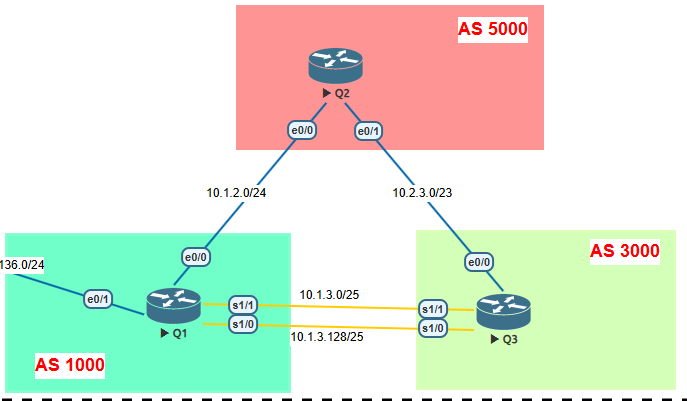

# 🔹 Lab 8 – BGP Configuration & Validation

In R1 you configured a prefix-list to filter the routes received from R2 (ASN5000). Before the filter, R2 was not only sending its own networks (192.168.2.0/27 and 192.168.2.64/26), but also routes that actually belonged to ASN3000, which appeared in the BGP table with the sequence 5000 3000. After applying the prefix-list ALLOWED_FROM_R2 with the in direction, R1 now only accepts networks directly originated in ASN5000 and discards those that R2 was propagating from ASN3000. In the new BGP table, only the routes with ASN5000 as the origin appear, confirming that the filter is working properly.

## ⚙️ Configuration
### 🔀 **R1** 
```bash
router bgp 1000
 bgp router-id 1.1.1.100
 bgp log-neighbor-changes
 neighbor 10.1.2.2 remote-as 5000
 neighbor 10.1.3.3 remote-as 3000
 neighbor 10.1.3.130 remote-as 3000
 !
 address-family ipv4
  network 192.168.1.0 mask 255.255.255.224
  network 192.168.1.64 mask 255.255.255.192
  neighbor 10.1.2.2 activate
  neighbor 10.1.2.2 prefix-list ALLOWED_FROM_R2 in           ✅
  neighbor 10.1.3.3 activate
  neighbor 10.1.3.130 activate
 exit-address-family
!
ip prefix-list ALLOWED_FROM_R2 seq 5 permit 192.168.2.0/24 le 27       ✅
```

-----

## 🔍 Validation

✅ Before 
```bash
Q1(config-router-af)#do sh ip bgp

     Network          Next Hop            Metric LocPrf Weight Path
 *>  192.168.1.0/27   0.0.0.0                  0         32768 i
 *>  192.168.1.64/26  0.0.0.0                  0         32768 i
 *>  192.168.2.0/27   10.1.2.2                 0             0 5000 i
 *>  192.168.2.64/26  10.1.2.2                 0             0 5000 i
 *   192.168.3.0/27   10.1.3.130               0             0 3000 i
 *                    10.1.2.2                               0 5000 3000 i
 *>                   10.1.3.3                 0             0 3000 i
 *   192.168.3.64/26  10.1.3.130               0             0 3000 i
 *                    10.1.2.2                               0 5000 3000 i
 *>                   10.1.3.3                 0             0 3000 i
```
✅ After 
```bash
Q1#sh ip bgp

     Network          Next Hop            Metric LocPrf Weight Path
 *>  192.168.1.0/27   0.0.0.0                  0         32768 i
 *>  192.168.1.64/26  0.0.0.0                  0         32768 i
 *>  192.168.2.0/27   10.1.2.2                 0             0 5000 i
 *>  192.168.2.64/26  10.1.2.2                 0             0 5000 i
 *   192.168.3.0/27   10.1.3.130               0             0 3000 i
 *>                   10.1.3.3                 0             0 3000 i
 *   192.168.3.64/26  10.1.3.130               0             0 3000 i
 *>                   10.1.3.3                 0             0 3000 i
```

-----

## 🖧 Topology



-----
